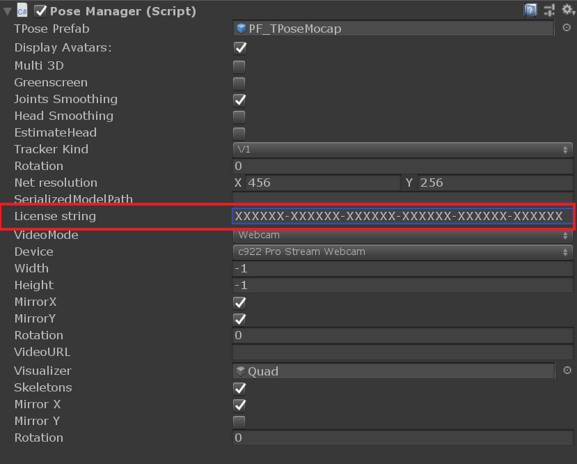

# Getting started 

This plugin demonstrates a way to use wrnchAI in Unity through a C# API. It is composed of two parts: 

* A Demo folder containing two example scenes (desktopScene, mobileScene) showing how to animate a 3D character using a video feed or still image 
with the use of the PoseEstimator. 
* A wrnchAI folder containing the scripts needed to develop a Unity application leveraging the wrnchAI pose estimation technology.

We provide support for the LTS Unity releases (2018.4.x): https://unity3d.com/unity/qa/lts-releases

The wrnchAI unity package is available for Windows and iOS development.

A license is required to run the pose estimator, please contact license@wrnch.ai for license related questions.

## Windows

### Prerequisites

For both the CPU and GPU version, wrDemo.exe will be located in `Assets/Plugins/wrnchAI/bin`. Run this program from outside Unity after installing the prerequisites to make sure everything is working correctly.

#### GPU:
 The GPU version requires to have CUDA 10.1 installed and configured in the `%PATH%` environment variable. See https://developer.nvidia.com/cuda-downloads for downloads and installation steps.

#### CPU:
 The CPU version comes with all the dependencies included. 

### Running an application
For Windows, before running this scene, make sure you setup your video source at least once in the PoseManager inspector.

### Standalone game
The provided desktopScene can run either in editor or standalone mode. For standalone mode, you will have to copy the content of `Assets/Plugins/wrnchAI/bin` from the wrnchAI package into \<appname\>_Data/Plugins. 
For the CPU version, if the dlls are located next to the game executable there is no need to modify the `%PATH%`.

## iOS

### Running on iOS
1. Open Build Settings and switch the build platform to iOS.
2. Open the player settings and set the iOS deployment to version 11.0+.
3. Generate an XCode project by selecting Build or Build and Run. 

Note: You will need to run the demo app on a connected iOS device. We do not support emulated devices or running in the Unity editor on MacOS.  

## Example project
 In the Demo folder imported with the unity package, a test scene is present. This scene contains a character already preconfigured, as well as a PoseManager object and a Quad for video source visualization.

## License

In the PoseManager inspector, enter your license key into the "License string" field.

 
## High level description

### PoseManager
The wrnchAI for Unity package is articulated around a PoseManager Component in charge of establishing communication between worker thread running the pose estimator and the Unity update loop. 
Most of the calls to GameObjects are required to be made on the main thread, the PoseManager will receive the pose results from the pose thread and broadcast them 
to GameObjects through it's Update function. It is also centralizing and exposing all the configuration objects through custom inspector and public fields. 

### Config objects
The plugin requires the use of various subsystems to run: 

* VideoController handling the video stream grabbing
* PoseWorker handling the pose estimation
* Visualizer(optional) displaying the video stream from the VideoController on an object containing a MeshRenderer or a UI Component containing a RawImage. It is 
also in charge of overlaying the skeletons on top of the video stream.
* AnimationController is a component which needs to be attached to every rigged character controlled by the pose estimator.

The parametrization of each of these components is done through configuration classes present in `wrnchAI.Config` namespace. During their initialization, subsystems 
will register to various events present in the configuration classes in order to be notified when a change is requested and react accordingly through the Onvalidate function.

### VideoController
The VideoController Component can be used in Webcam or File mode. 

In Webcam mode, the PoseManager inspector selecting "Auto" as device name will automatically select the first device available during the early initialization phase. 

### AnimationController 

Each character that needs to be animated in the scene needs to have a AnimationController component. The wrnch PoseEstimator is doing joint based pose estimation, and returns a pose composed of a set of quaternions in world space for each of the 30 joints of the 
wrExtended joint definition. In order to consume those, the rig needs to be set as Generic and not Humanoid. Humanoid rigs in Unity are animated using muscle space instead of joint space.
If the Joints Smoothing option is enabled in the pose manager, a smoothing step is applied in the backend. This smoothing can be controlled with the SmoothingBeta parameters exposed through the PoseParams class. The internal implementation of this filter is relatively similar to the One Euro Filter (http://cristal.univ-lille.fr/~casiez/1euro/)

The AnimationController contains a JointFilter component, which is in charge of converting the raw input from the pose estimator to the right space, and performs spherical linear interpolation on each joint for low pass filtering on the input in order to remove more noise. 
The joints smoothing is a tradeoff between input lag and motion smoothness. Keep in mind that this implementation is provided as an example of how to use our API in Unity, and each application might require a different way of smoothing the input data.

When adding the AnimationController to an existing character, a setup is needed for joints binding. Each joint exposed by wrnchAI can be bound to a GameObject (usually a rig joint). Partial bindings are accepted, but in order to get a 3D pose estimation hips and shoulders joints are mandatory.
PF_TPosedMocap contains an avatar with every joint already bound.

The underlying IK system requires a character initialized in a TPose. This can be easily achieved by using the enforce T-Pose feature provided by Unity when configuring the rig.

## FAQ

### Failed to find wrAPI.dll.

This error message can come from multiple source. The first step would be to ensure that the content of the bin folder of the wrnchAIengine package has been copied under Assets/Plugins/wrnchAI. If this is the case and the message still appear, run the wrDemo application in this folder from a terminal. In Unity, the standard output for the unmanaged layer is hidden and some error messages are hidden, especially concerning dependencies. 
If wrDemo works and the message still appears, we recommend updating windows. Running applications developped with the Microsoft Windows 10 SDK in a managed context requires some specific libraries provided through windows update.

### Failed to find wrAPI.bundle. 

We do not provide support for MacOS, if this error appears you are probably trying to run an application targeting iOS with the wrong build settings. Go into File->Build Settings and specify iOS as target platform.

### Exception: License file not found in home directory, license string not provided, and no valid key found in the environment variable WRNCH_LICENSE. See the user guide for instructions on providing a license.

You need to fix how you are providing the license file to Unity. You have one of 3 options:

Option 1: You can input the License string into the Pose Manager in the "License String" field. Refer to the section above called "License"

Option 2: You can change your WRNCH_LICENSE environment variable and set it to the key in the format: 

XXXXXX-XXXXXX-XXXXXX-XXXXXX-XXXXXX-XXXXXX

Option 3: If you have an old style license, you can put the wrnch.lic file in the home directory of the user

    Windows: C:\Users\user_name
    iOS: /Users/user_name